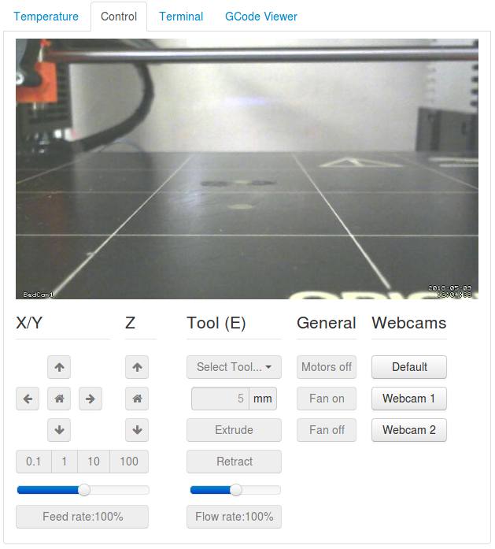
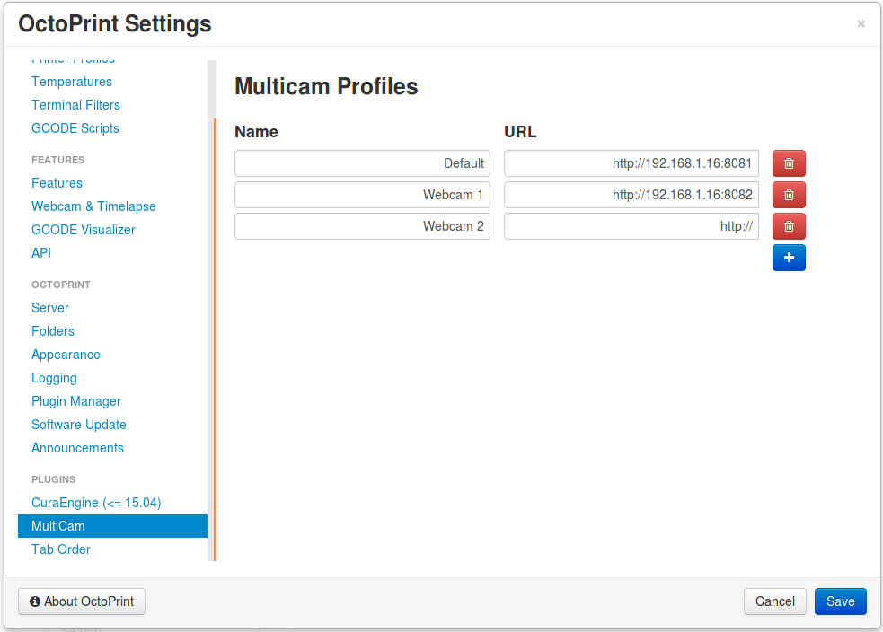

# OctoPrint MultiCam
Extents the Control tab to include a webcam section with buttons that you can configure in the settings to switch between multiple webcam feeds.

Future updates will include the more options to show different types of streams, as well as the abilitly to show more than one stream at a time.

## Setup

Install via the bundled [Plugin Manager](https://github.com/foosel/OctoPrint/wiki/Plugin:-Plugin-Manager)
or manually using this URL:

    https://github.com/mikedmor/OctoPrint_MultiCam/archive/master.zip
    
It is recommended to setup a second RPi (potentially with [MotionEyeOS](https://github.com/ccrisan/motioneyeos)) to setup webcams from. Attaching more than one webcam to your octoprint device could result in high proccess use causing issues with your prints. You may also have to invest in a usb hub to power your webcams as RPi's tend to have low votage issues when they are plugged in directly to the Rpi. [This Link](https://elinux.org/RPi_Powered_USB_Hubs) has a good list of USB hubs that are support by Raspberry.

## Screenshots

## Support my work
Programming is not only my job, but also something I enjoy doing in my spare time. If you enjoy my work, or received support from me, please consider sending me a donation so i may continue working on projects in my spare time. Thank you

